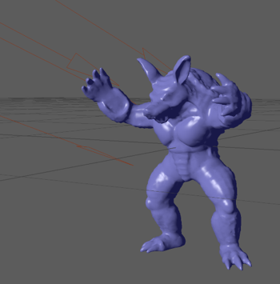

3Dファイルの読み込み
====

FBX SDKを使うとファイルの読み込みが簡単にできます．

``` Python
scene_file = "Armadillo.obj"

# FBXの初期化
manager = FbxManager.Create()

# ファイル読み込み用のsceneの作成
scene = FbxScene.Create(manager, "Scene")

# ファイル読み込み処理
FbxImporter.Create(manager, "")
if not importer.Initialize(scene_file, -1):
    print("Fail: Create Importer ", scene_file)
elif not importer.Import(scene):
    print("Fail: Import scene")

# FBXの解放
manager.Destroy()
```

この例では，objモデルをFBX SDKを使って読み込んでみました．
ただし，これだけだと，正しくファイルが読み込めているかどうかわかりません．

そこで，以下のようにしてsceneの中にある情報を出力してみます．

``` Python
def dumpNodeInfo(node):
    # nodeの名前を出力
    print (node.GetName())

    # 子nodeを探索し，再帰的にdumpする．
    num_childrens = node.GetChildCount()
    for ci in range(num_childrens):
        child_node = node.GetChild(ci)
        dumpNodeInfo(child_node)

# Root nodeの取得
root_node = scene.GetRootNode()

# 再帰的にnode情報を出力
dumpNodeInfo(root_node)
```

まず，```scene.GetRootNode()```関数でsceneの中にあるFbxNode型のroot nodeを取得します．
root nodeはツリー構造になっていますので，
dumpNodeInfo関数では，再帰処理で情報を出力しています．

中の処理は単純で，

1. nodeの名前を出力する
2. 子nodeを探索し，再帰的にdumpNodeInfo関数を呼び出す

だけです．

"Armadillo.obj"の場合，出力は以下のようになりました．

``` bash
RootNode
Armadillo_root
```

Armadillo_rootがnodeの名前として出力されていますので，
"Armadillo.obj"からデータが読み取れていることが分かります．

試しに，Mayaで"Armadillo.obj"を開いて，ライトを追加し，
FBXデータ形式で保存してみました．



上のスクリプトで読み込むと，以下のように出力されました．

``` bash
RootNode
Mesh
directionalLight1
```

directionalLight1が出力され，
Mayaで作成されたライト情報がFBXから読み込めているのが分かります．

今回は，ファイルの読み込みを題材に必要最低限のFBX処理を見ていきました．
次回以降では，各nodeタイプごとの情報の取得について見ていきたいと思います．