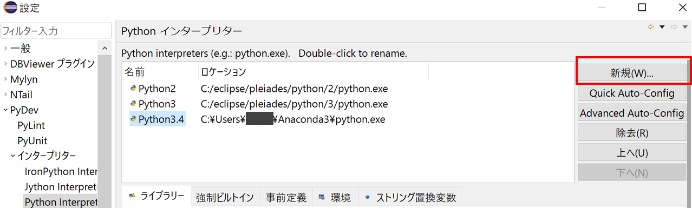

Eclipse - PyDevの設定
====

まず，Pythonの動作に最低限必要なインタプリターへのパス設定を行います．

ウィンドウ->設定->PyDev->インタプリター->設定を選びます．
初期状態では，EclipseにインストールされているPython2, Python3のインタプリターが設定されているだけです．
新規を選び，Anaconda用のインタプリターを構成します．



インタプリター名には，"**condaPython3**"など分かりやすい名前を設定し，
インタプリター実行可能ファイルには，AnacondaのPython実行ファイルを指定します．
デフォルトの設定だと，```C:/Users/[UserName]/Anaconda3/python.exe```にPython実行ファイルがありますので
それを指定します．

## Pythonプロジェクトの作成

ファイル->新規->Pydevプロジェクトを選択します．

プロジェクト名には，自分が開発するプロジェクト名を入れましょう．
例えば，"**HelloPython**"と入れてみましょう．

プロジェクト・コンテンツには，プロジェクトを保管したいフォルダの場所を指定します．
デフォルトだと，eclipseのworkspace以下に配置されます．
GitHubからクローンしたディレクトリ等を使いたい場合，
デフォルトを使用のチェックを外して，そのフォルダを参照から選びます．

プロジェクト・タイプはとりあえず"Python"のままで問題ないです．

文法バージョンは，今回Python3系を使うので，**3.0**を指定しておきましょう．

インタプリターには，先ほど設定した**condaPython3**を指定します．

完了ボタンを押すと，Pythonプロジェクトが出来上がります．

| 設定項目    | 例                    |
|:-----------|:----------------------|
| プロジェクト名 | HelloPython |
| プロジェクト・コンテンツ | デフォルトの使用オフ， ```C:/GitHub/HelloPython``` |
| プロジェクト・タイプ | Python |
| 文法バージョン | 3.0 |
| インタプリター | condaPython3 |

## Pythonスクリプトの追加

新しいPythonスクリプトの追加は，
パッケージ・エクスプローラ上で右クリック->新規->Pydevモジュールを選択するとできます．
ここでは，名前を"**hello_python**"にしました．
Pythonでは，小文字で始まるスネークケースがモジュール名によく用いられます．

デフォルトだと，以下のようなシンプルなスクリプトファイルが出来上がります．

``` Python
'''
Created on 2016/06/24

@author: [UserName]
'''
```

簡単ではありますが，文字を表示するプログラムを作成してみましょう．

まずは，Pythonスクリプトにmain関数部分を追加します．
エディタ上でmainと打ち込んでみましょう．

すると，自動的にコード補完機能が働いて，
```main - main function pattern.```の候補が表示されたかと思います．
それを選ぶと，
自動的にmain関数が挿入されます．

main関数内に，print文を挿入して文字を出力します．
最終的なコードは以下の形になります．

``` Python
'''
Created on 2016/06/24

@author: tody
'''

if __name__ == '__main__':
    print("Hello Python")
```

上記のコードは，**F9キー**を押すと実行できます．
すると，コンソールウィンドウ内に```Hello Python```の文字が表示されたと思います．

簡単ではありますが，以上がPythonスクリプトを作成・実行する基本の流れになります．

## Pythonパッケージの追加

少し規模が大きなPythonプログラムになってくると，
スクリプトを階層構造で管理したくなってきます．
そんな時に使えるのが，Pythonパッケージの機能です．

右クリックから，新規->Pydevパッケージを選ぶとPythonパッケージを追加できます．
名前を"**hello_package**"にしてみましょう．
モジュール名と同様に，パッケージ名でもスネークケースがよく使われます．

パッケージ内にモジュールを追加すると，

* ```hello_package```
    - ```package_module1```
    - ```package_module2```
    - ```subpackage```
        - ```subpackage_module1```

のような階層構造を作ることができます．
```subpackage```のように，パッケージ内に子パッケージを作成することも可能です．

## その他 Eclipseの便利な機能

### コード補完

実際にコードを書くと，入力の途中でコードを補完してくれます．
明示的にコードを補完したい場合，"Ctrl + Space"を押すとコード補完をしてくれます．

また，ウィンドウ->設定->PyDev->エディター->テンプレートから，
独自のコード補完を登録しておくことも可能です．

よく使う記法やコメント類はこちらにまとめておくと便利です．

### コード整形機能

PyDevには，ファイルの保存時に自動でコード整形を行う機能がついています．
ウィンドウ->設定->PyDev->エディター->コード・フォーマッター項目から，
"use autopep8.py"にチェックが入っているか確認しましょう．

また，エディター->保管アクションの項目を開き，
"Auto-format editor contents..."にチェックを入れましょう．

この設定により，
```(param1,param2) → (param1, param2)```(スペースの調整)等，
Pythonでよく使われる記法に合わせて，
コードを整形してくれます．