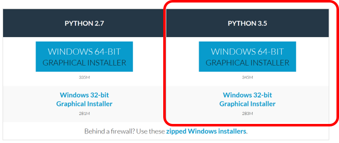
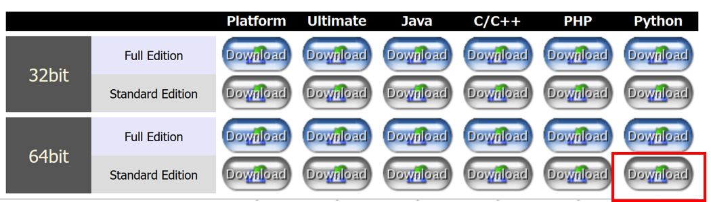

Pythonのインストール
====

本章では，筆者の開発環境からWindowsの場合のインストール方法について解説します．

以前は，PythonをWindows 64bit環境で使おうとすると，
多くのライブラリでは公式版が存在せず，
64bit版の非公式ライブラリ配布サイトからインストール用のファイルをダウンロードしてきて，
インストールするという作業が必要でしたが，
**Anaconda**の登場により，作業が大分楽になりました．

基本的には，Anacondaを入れるだけです．

## Anacondaのインストール

[公式ページのダウンロードサイト](https://www.continuum.io/downloads)より，
Anacondaをインストールします．
Python2.x系とPython3.x系に分かれていますが，
これは，ライブラリによっては古いPython2.x系の環境でしか提供されていない物があるからです．

本サイトの方針としては，
Python3.x系を利用し，ライブラリもなるべく最新の物を使うようにしていきます．

公式ページから，のファイルをダウンロードし，実行してください．
インストールオプションもデフォルトのままで構いません．

このインストール作業により，
**Numpy**, **Scipy**等，Pythonでよく使われるライブラリはデフォルトでインストールされます．

開発内容によっては，
これらに加えて新たにライブラリをインストールする必要がありますが，
それについては各トピックの最初に触れたいと思います．

## 開発環境に関して

Pythonを実行できる環境にあれば，特にエディタは何でも構いません．
私自身は，まだPythonエディタがそんなに充実していなかった時代から使い続けているのもあり，
Eclipse + PyDevの環境を利用しています．

上記の開発環境を日本語で揃えたいという人は，
[Pleiades - Eclipse プラグイン日本語化プラグイン ](http://mergedoc.osdn.jp/)のサイトから統合パッケージをダウンロードするのがおススメです．

こちらには，Pythonを開発するためのPyDevプラグインがあらかじめ入っていますので，
設定が非常に楽です．
(容量に余力がある人は，Full Editionや他の言語も込みのパッケージを選んでも良いかもしれません．)

デフォルトから変更する部分としては，
PyDevで参照するPythonインタプリターをAnacondaの物を指定する位です．
この設定を行うと，スクリプトをエディタで開発し，実行するという一連の作業ができるようになります．

さらに，PyDevを便利に使うための設定については，
[Eclipse - PyDevの設定](eclipse_setting.md)こちらにまとめます．

他のエディタの選択肢として，代表的なものを以下に挙げておきます．

* PyScripter
    - 公式ページからPythonをインストールすると，デフォルトでついてきます．
    - 参考サイト: [Pythonの開発環境にはPyScripterがとってもおススメ](http://blogs.itmedia.co.jp/murayama/2013/11/pythonpyscripte-c462.html)
* [PyCharm](https://www.jetbrains.com/pycharm/)
    - 有償版はWeb開発周りが充実．
    - 参考サイト： [最強のPython統合開発環境PyCharm](http://qiita.com/yamionp/items/f88d50da8d6b548fc44c)
* [Ninja IDE](http://www.ninja-ide.org/)
    - Pythonで作られたPython専用のIDE．
    - 参考サイト： [PythonのPythonによるPythonのためのIDE（統合開発環境）「Ninja IDE」](http://www.moongift.jp/2011/03/20110303-2/)
* Sublime, Atom等 汎用テキストエディタ系
    - 小規模開発であれば，これでも十分に事足ります．普段使っている方であれば，簡単なコード書きには便利です．

みなさんの好みもあると思いますので，ぜひ色々実験してみて合った物を見つけてください．