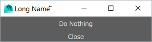
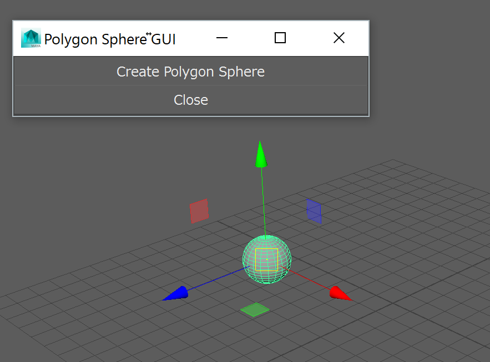
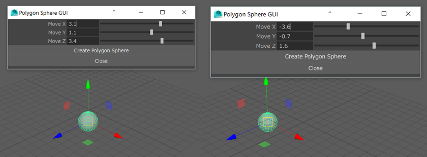

MayaでのPython開発
====

3DCGソフトウェアのMayaでは，Pythonスクリプトによるコマンド実行処理・プラグイン開発をサポートしています．
Mayaが使っているPythonのバージョンは2.x系で古く，公式に配布されている物とも違っているので少し注意が必要です．

| Mayaのバージョン  | Pythonのバージョン     |
|:-----------|:----------------------|
| Maya2016 | Python2.7 |
| Maya2015 | Python2.7 |
| Maya2014 | Python2.7 |
| Maya2013 | Python2.6 |

エディタに関しては，Pythonのコードをかける物なら基本なんでも構いません．
私自身は，通常のPythonプログラム開発でもEclipseを使っているため
Eclipseで開発することが多いです．

実行自体は，
Mayaのスクリプトウィンドウから行うので，
Eclipseでのコード編集とMayaのスクリプトウィンドウでの実行を行ったり来たりしながら開発を進めます．

MayaでPythonプログラミングする際，
Mayaから提供される以下の3つのフレームワークを状況に応じて使い分けます．

* Pythonコマンド: Mayaの各編集処理をコマンド化した物です．
* PyMEL: PythonコマンドをよりPythonらしく，オブジェクト指向のように扱える機構です．
* Python API: Mayaに新しいノードを追加したり，コマンドでは扱えない部分を開発可能です．

## MayaでのPythonツール開発の流れ

Pythonに限りませんが，Mayaでシステムを開発する際の流れは大体以下のようになります．

1. Mayaに搭載されている機能をあれこれ実験してみる．
    - 実現したい項目の基本操作を抑える．
    - 開発が必要な機能(足りない機能)を調査する．
2. 関連するコマンドを簡単に実験してみる．
    - Mayaで編集操作を行うとスクリプトウィンドウに実際に行われたMELコマンドが表示される．
    - Maya ヘルプから，該当するコマンドのPython版を検索し，サンプルコードを実験する．
3. Pythonコマンドの組み合わせ + GUIで簡単なツールを作成してみる．
    - 編集操作の一連の流れがPythonコマンド列に対応するので実験結果を見ながら組み合わせを調整していく．
    - GUIについてもサンプルコードを実験し，自作コマンドを各GUIに割り当てる．
4. PyMELでPythonプログラムの整形
    - Pythonコマンドでかかれたプログラムは，PyMELに比べるとあまり直感的ではない．
    - PyMEL ヘルプから対応する関数を検索し，PythonコマンドをPyMEL表現に置き換えていく．
    - PyNode関数で各オブジェクトの固有のクラス型に変換できるので，各クラスから呼び出せる関数を調べてオブジェクト指向型に置き換えてみる．
5. 足りない機能をPython APIで補う．
    - 新しいノード(データ構造，計算処理の1セット)を追加する部分は，Pythonコマンド，PyMELでは扱えない．
    - Python API ヘルプを参照しながら必要な機能を開発していく．

難易度も順に上がっていきますので，まずは1～3あたりを実験していくことをおススメします．
速度が必要という条件がついてくると，
C++での開発やPython APIを利用することを検討する必要がありますが，
初めのうちは，PyMELとPython APIに関してはあくまでオプションという形で構わないと思います．

以下では，Pythonコマンド，PyMEL，Python APIに関してそれぞれ簡単に開発ガイドをまとめます．

## Pythonコマンド

#### Mayaの編集操作とMELコマンド処理の対応

まずは，Mayaに搭載されている機能を色々実験してみましょう．
その際に，Mayaのスクリプトウィンドウを確認してみてください．


例えば，ポリゴン球をメニューから選んで作成すると，

``` cpp
polySphere -r 1 -sx 20 -sy 20 -ax 0 1 0 -cuv 2 -ch 1;
```

のようなコマンド出力がスクリプトウィンドウ内に表示されます．```-r 1```は半径1，```-sx 20```はx方向の分割数といったように，
ポリゴン球を作成する際のパラメータを表しています．

また，作成された球をつまんで動かすと，

``` cpp
move -r -4.290462 1.603997 3.087464 ;
```

今度は上のようなコマンドがスクリプトウィンドウに表示されたかと思います．```-r```は現在の位置から相対的に動かすことを意味し，
xyz方向にそれぞれ，```(-4.290462, 1.603997, 3.087464)```移動させることを意味しています．
これらのコマンドは，Maya独自のMELスクリプトの形式で表されたコマンド文字列です．

実際に，これらをコマンドとして再現してみましょう．
まず，

``` cpp
polySphere -r 1 -sx 20 -sy 20 -ax 0 1 0 -cuv 2 -ch 1;
```

をスクリプトエディタ上にコピーします．タブがMELになっていることを確認してください．
スクリプトエディタ上で，コマンド文字列を選択し，```Ctrl + Enter```を押すとコマンドを実行できます．
すると，Mayaの3Dビュー上にポリゴン球が作成されたかと思います．

次に，ポリゴン球の移動についても実験してみましょう．

``` cpp
move -r -4.290462 1.603997 3.087464 ;
```

をスクリプトエディタ上にコピーし，```Ctrl + Enter```で実行してください．
すると，今度は球が移動したのを確認できると思います．

今は一つずつコマンドを実行してみましたが，これらをまとめて実行することも可能です．

``` cpp
polySphere -r 1 -sx 20 -sy 20 -ax 0 1 0 -cuv 2 -ch 1;
move -r -4.290462 1.603997 3.087464 ;
```

スクリプトエディタ上に上記のコマンド文字列をまとめてコピーし，
選択する際もまとめて選択した後，```Ctrl + Enter```を押してください．

すると，編集操作がひとまとめになり，ポリゴン球が作成された後移動した状態で
3Dビュー上に表示されたかと思います．

#### MELコマンドのPython化

それでは，先ほど行った処理をPythonコマンド化してみましょう．
Pythonコマンドでは，基本MELコマンドと同じ名前の関数が使えるようになっていて，
[公式ヘルプ](http://help.autodesk.com/view/MAYMAUL/2016/JPN/)->テクニカルドキュメント->Pythonコマンド
から検索することが可能です．
また，テクニカルドキュメント->MELコマンドにも同じ形式のヘルプが載っていますので違いを見比べることもできます．

それでは，早速Python化を進めてみましょう．まずは，Pythonコマンドのヘルプから，
polySphereコマンドを探してみてください．
Pythonコマンドでは，基本的に入力引数がMELコマンドと同じになるようにデザインされています．

``` Python
import maya.cmds as cmds

cmds.polySphere(r=1, sx=20, sy=20, ax=(0, 1, 0), cuv=2, ch=1)
```

一番上にあるimport文は，PythonでMayaコマンドを扱うための**maya.cmds**パッケージを呼び出しています．
Pythonの場合，```ax=(0, 1, 0)```のようにタプル形式を使ってリスト型の
引数を指定する部分が違いますが，基本的には機械的に入力引数を変換できると思います．

それでは，このPythonコマンドを実際にスクリプトエディタから実行してみましょう．
基本的には，MELコマンドと同様ですが，**タブをPython側**に切り替えて
コマンド文字列をコピーします．
コマンド文字列を選択し，```Ctrl + Enter```を押すと，
MELコマンドと同様にポリゴン球が作成されたかと思います．

移動についても同様に変換を行うと，

``` Python
cmds.move(-4.290462, 1.603997, 3.087464, r=True)
```

となります．ここで，```r=True```となっていますが，
moveコマンドの```-r```のようにMEL側で後ろに値が来ないフラグは
onとoffを切り替えていますので，
Python側では```True```か```False```を指定します．

コマンド全文は，合わせて

``` Python
import maya.cmds as cmds

cmds.polySphere(r=1, sx=20, sy=20, ax=(0, 1, 0), cuv=2, ch=1)
cmds.move(-4.290462, 1.603997, 3.087464, r=True)
```

となります．
入力パラメータを変えるとコマンドの結果も変わりますので，
色々いじって実験してみてください．

また，各コマンドのヘルプには，必ずサンプルプログラムがついているので，
それを実験するとそのコマンドでできることを簡単に把握できます．

#### GUIの作成

それでは，先ほどのポリゴン球を作成するコマンドについて
簡単なGUIを作成してみましょう．

まずは，とくにかくWindowが必要です．
Pythonコマンドのヘルプから**window**コマンドを探します．
サンプルプログラムが載っているので，
Windowを作る部分を抜き出して実行します．

``` Python
import maya.cmds as cmds

# Make a new window
#
window = cmds.window( title="Long Name", iconName='Short Name', widthHeight=(200, 55) )
cmds.columnLayout( adjustableColumn=True )
cmds.button( label='Do Nothing' )
cmds.button( label='Close', command=('cmds.deleteUI(\"' + window + '\", window=True)') )
cmds.setParent( '..' )
cmds.showWindow( window )
```

すると，以下のようなボタン付きのシンプルなWindowが作成されます．



ここでは，Windowの名前が指定されている場所やボタン処理の割り当て方法を確認しておきます．
まず，今回はポリゴン球を作成するGUIなのでWindowの名前を変更しましょう．

``` Python
window = cmds.window( title="Polygon Sphere GUI", iconName='polySphere', widthHeight=(200, 55) )
```

次に，ポリゴン球を作成するコマンドをボタンに割り当ててみます．
このwindowのサンプルプログラムだけではやり方が分かりにくいですが，
buttonコマンドのヘルプを見るとやり方が分かります．

``` Python
def defaultButtonPush(*args):
    print 'Button 1 was pushed.'

...
cmds.button( label='Button 1', command=defaultButtonPush )
```

重要なのは，```*args```を引数とする関数を定義し，button関数を呼び出すときにそれを```command```引数で指定します．

それでは，早速ポリゴン球の作成でもやってみましょう．

``` Python
import maya.cmds as cmds

def createPolySphere(*args):
    cmds.polySphere(r=1, sx=20, sy=20, ax=(0, 1, 0), cuv=2, ch=1)
    cmds.move(-4.290462, 1.603997, 3.087464, r=True)

window = cmds.window( title="Polygon Sphere GUI", widthHeight=(200, 55) )
cmds.columnLayout( adjustableColumn=True )
cmds.button( label='Create Polygon Sphere', command=createPolySphere)
cmds.button( label='Close', command=('cmds.deleteUI(\"' + window + '\", window=True)') )
cmds.setParent( '..' )
cmds.showWindow( window )
```

すると，以下のようにGUI Windowのボタンが変わり，
Create Polygon Sphereを押すと，
ポリゴン球が作成・移動処理が実行されます．



それでは，さらにポリゴン作成に関するパラメータをスライダーでコントロールするようなGUIを作ってみましょう．
スライダーの作成には，floatSliderGrpコマンドを使います．

``` Python
cmds.floatSliderGrp( label='Move X', field=True, minValue=-10.0, maxValue=10.0, value=0.0)
cmds.floatSliderGrp( label='Move Y', field=True, minValue=-10.0, maxValue=10.0, value=0.0)
cmds.floatSliderGrp( label='Move Z', field=True, minValue=-10.0, maxValue=10.0, value=0.0)
```

をGUIとして追加してみましょう．
すると，スライダーとテキスト入力付きのGUIが表示されるようになります．

次に，ポリゴン球の移動をこのスライダーで指定された値を使うようにcreatePolySphereを書き換えてみましょう．

``` Python
import maya.cmds as cmds

x_slider_name = ""
y_slider_name = ""
z_slider_name = ""

def createPolySphere(*args):
    cmds.polySphere(r=1, sx=20, sy=20, ax=(0, 1, 0), cuv=2, ch=1)
    x_value = cmds.floatSliderGrp(x_slider_name, q=True, value=True)
    y_value = cmds.floatSliderGrp(y_slider_name, q=True, value=True)
    z_value = cmds.floatSliderGrp(z_slider_name, q=True, value=True)
    cmds.move(x_value, y_value, z_value, r=True)

window = cmds.window( title="Polygon Sphere GUI", widthHeight=(200, 55) )
cmds.columnLayout( adjustableColumn=True )

x_slider_name = cmds.floatSliderGrp( label='Move X', field=True, minValue=-10.0, maxValue=10.0, value=0.0)
y_slider_name = cmds.floatSliderGrp( label='Move Y', field=True, minValue=-10.0, maxValue=10.0, value=0.0)
z_slider_name = cmds.floatSliderGrp( label='Move Z', field=True, minValue=-10.0, maxValue=10.0, value=0.0)
cmds.button( label='Create Polygon Sphere', command=createPolySphere)
cmds.button( label='Close', command=('cmds.deleteUI(\"' + window + '\", window=True)') )
cmds.setParent( '..' )
cmds.showWindow( window )
```

ここで重要なのが，以下のスライダーの値を取得するための構文です．

``` Python
cmds.floatSliderGrp(slider_name, q=True, value=True)
```

qフラグは，パラメータを照会することを表しており，```value=True```とすることで，
欲しいパラメータがスライダーの値であることを指定しています．

PythonコマンドがMEL構文の単純な置換になっており，
スライダー名を介して情報をやり取りするため，
スライダーの値の参照部分があまり綺麗ではありませんが，
上記のスクリプトで以下のように移動のカスタマイズができるようになります．



## PyMEL

MayaのPythonコマンドは，基本MELコマンドの構文を置換しただけなので，あまりPythonフレンドリーにできていません．
そこで登場したのがPyMELで，Pythonコマンドよりも直感的にオブジェクト指向でMayaのSceneデータにアクセスできます．

#### PyMELでPythonプログラムの整形

まずは，PyMEL関数を使えるようにするためのimport文です．

``` Python
import pymel.core as pm
```

構文の大体はmaya.cmdsと対応していて，
pm.polySphereのような形で呼び出すことが可能です．
PyMELを使う大きな違いは，戻り値がオブジェクトの名前ではなく，
オブジェクトのインスタンスが返される点です．

``` Python
import pymel.core as pm

# maya.cmds同様のポリゴン球作成．
sphere = pm.polySphere(r=1, sx=20, sy=20, ax=(0, 1, 0), cuv=2, ch=1)[0]

# オブジェクトを直接操作するような移動の構文．
sphere.setTranslation((-4.290462, 1.603997, 3.087464))
```

それでは，先ほどのPythonプログラムをPyMEL形式に置き換えてみましょう．

``` Python
import pymel.core as pm

def createPolySphere(x_slider, y_slider, z_slider):
    def cmd(*args):
        sphere = pm.polySphere(r=1, sx=20, sy=20, ax=(0, 1, 0), cuv=2, ch=1)[0]
        x_value = x_slider.getValue()
        y_value = y_slider.getValue()
        z_value = z_slider.getValue()
        sphere.setTranslation((x_value, y_value, z_value))
    return cmd

with pm.window(title="Polygon Sphere GUI", widthHeight=(200, 55)) as polysphere_gui:
    def closeWin(*args):
        polysphere_gui.delete()

    with pm.columnLayout():
        x_slider = pm.floatSliderGrp( label='Move X', field=True, minValue=-10.0, maxValue=10.0, value=0.0)
        y_slider = pm.floatSliderGrp( label='Move Y', field=True, minValue=-10.0, maxValue=10.0, value=0.0)
        z_slider = pm.floatSliderGrp( label='Move Z', field=True, minValue=-10.0, maxValue=10.0, value=0.0)

        pm.button( label='Create Polygon Sphere', command=createPolySphere(x_slider, y_slider, z_slider) )
        pm.button( label='Close', command=closeWin )
```

処理自体は，Pythonコマンドで紹介したものとほぼ同じですが，
データへのアクセスの仕方・構文は少し異なっています．

まず，ウィンドウ作成方法が少し変わりました．

``` Python
with pm.window(title="Polygon Sphere GUI", widthHeight=(200, 55)) as polysphere_gui:
    ...

    with pm.columnLayout():
        ... GUI作成処理
```

のようになり，GUIの構造がよりわかりやすくなっています．

また，スライダーの値の取得方法も変わりました．

``` Python
x_slider = pm.floatSliderGrp( label='Move X', field=True, minValue=-10.0, maxValue=10.0, value=0.0)
...
x_value = x_slider.getValue()
```

と書けるのでかなり直感的に値を取得することができます．

元々の例の```x_slider_name=""```のように，```x_slider, y_slider, z_slider```を
グローバル変数にすることも可能ですが，
ここでは，```createPolySphere```でこれらを受け取れるように変更しています．
ただし，実際にボタンに関数を割り当てるためには，```cmd(*args)```型の関数が必要になるので，```createPolySphere```内部でそれを定義して
関数の最後で```cmd```関数を返すという少しトリッキーなことをしています．

これは，Pythonならではの書き方で，
今回のように，必要な関数の型が決まっている(```cmd(*args)```型)が
外部の情報も参照したい(```x_slider, y_slider, z_slider```)場合には
よく使われますので覚えておくといいかと思います．

非常に簡単な例が題材ではありますが，

1. Mayaに搭載されている機能をあれこれ実験してみる．
2. 関連するコマンドを簡単に実験してみる．
3. Pythonコマンドの組み合わせ + GUIで簡単なツールを作成してみる．
4. PyMELでPythonプログラムの整形

の流れを確認しました．

PythonコマンドやPyMELの特徴についてまだ紹介しきれていない部分も多いですが，
導入の基礎部分としては，必要な部分をカバーしていると思います．

是非みなさんも独自のツールを開発してみてください．

参考サイト:

* [PyMEL公式リファレンス(英語)](http://help.autodesk.com/cloudhelp/2016/ENU/Maya-Tech-Docs/PyMel/)
* [デジタル・フロンティア: 優しいpymel氏　– スクリプト入門者のあなたへ 2-](http://www.dfx.co.jp/dftalk/?p=3357)

## Python API

C++と同様に，Pythonスクリプトでプラグインを作成することができます．
Python, PyMELよりも高速に動作しますが，コードの記述は少し複雑になります．

参考サイト:

* [はじめてPythonで書くMayaデフォーマ](http://www.dfx.co.jp/dftalk/?p=10981)