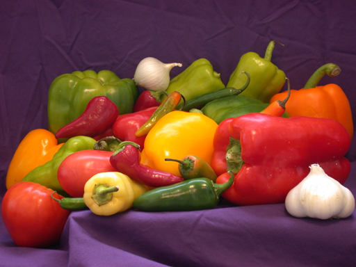
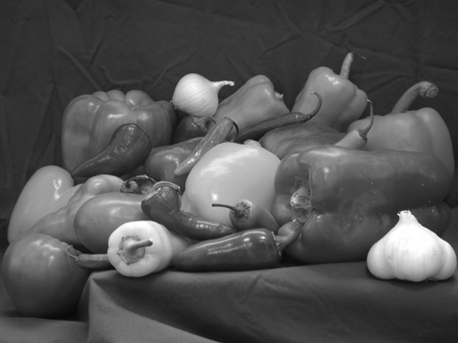
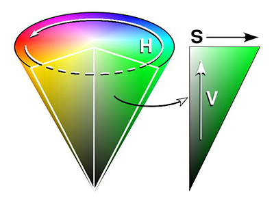
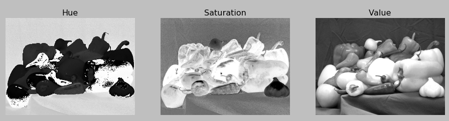
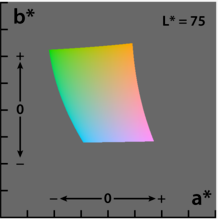
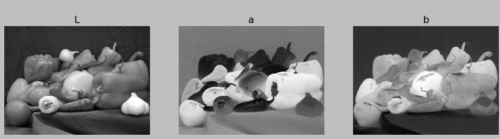

画像処理: 色空間の変換
====

ここでは，ラベル付き画像を簡単に表示するため，
matplotlibを使って画像を表示します．

## RGB画像とグレースケール画像の表示

#### BGR画像の読み込み

``` Python
# RGB画像の表示
def showImageRGB(image_file):
    image_bgr = cv2.imread(image_file)
    image_rgb = cv2.cvtColor(image_bgr, cv2.COLOR_BGR2RGB)
    plt.title('RGB')
    plt.imshow(image_rgb)
    plt.axis('off')
    plt.show()
```

RGB画像が表示されます．



#### グレースケール画像の読み込み

画像読み込み時に```cv2.imread```関数で```0```を指定すると，
グレースケール画像での読み込みになります．

``` Python
# グレースケール画像の表示
def showImageGray(image_file):
    image_gray = cv2.imread(image_file, 0)
    plt.title('Gray')
    plt.gray()
    plt.imshow(image_gray)
    plt.axis('off')
    plt.show()
```

グレースケール画像が表示されます．



## BGRからHSVへの変換

BGRからHSVへ画像を変換します．



HSV色空間では，

* Hue (色相)
* Saturation (彩度)
* Value (明度)

の3成分で色を表します．

BGR画像からHSV画像への変換は，cv2.cvtColor関数を使います．

``` Python
image_hsv = cv2.cvtColor(image_bgr, cv2.COLOR_BGR2HSV)
```

HSV画像はそのままimshow関数で表示しても正しく表示されません．
そこで，下記のようにHue, Saturation, Valueのようにそれぞれのチャンネルに分けて
画像特徴を観察していきます．

``` Python
    H = image_hsv[:, :, 0]
    S = image_hsv[:, :, 1]
    V = image_hsv[:, :, 2]

    plt.subplot(1, 3, 1)
    plt.title('Hue')
    plt.gray()
    plt.imshow(H)
    plt.axis('off')

    plt.subplot(1, 3, 2)
    plt.title('Saturation')
    plt.gray()
    plt.imshow(S)
    plt.axis('off')

    plt.subplot(1, 3, 3)
    plt.title('Value')
    plt.gray()
    plt.imshow(V)
    plt.axis('off')
```

下記のようにHSV画像を観察できます．



RGBで観測できない色相や彩度を見ることによって
領域分割やその他画像処理結果が良くなる場合があります．

HSV画像は```cv2.COLOR_HSV2BGR```を指定することでBGR画像に戻すことができます．

``` Python
image_bgr = cv2.cvtColor(image_hsv, cv2.COLOR_HSV2BGR)
```

## BGRからLabへの変換

Lab色空間は，明度を表すLと補色次元を表すa, bの計3チャンネルからなります．



BGR画像からLab画像への変換は，```cv2.COLOR_BGR2LAB```を使います．

``` Python
image_Lab = cv2.cvtColor(image_bgr, cv2.COLOR_BGR2LAB)
```

HSV画像の時と同様に，各チャンネル成分に分解して画像を観察していきます．

``` Python
    L = image_Lab[:, :, 0]
    a = image_Lab[:, :, 1]
    b = image_Lab[:, :, 2]

    plt.subplot(1, 3, 1)
    plt.title('L')
    plt.gray()
    plt.imshow(L)
    plt.axis('off')

    plt.subplot(1, 3, 2)
    plt.title('a')
    plt.gray()
    plt.imshow(a)
    plt.axis('off')

    plt.subplot(1, 3, 3)
    plt.title('b')
    plt.gray()
    plt.imshow(b)
    plt.axis('off')

    plt.show()
```



Lab色空間は人間の視覚を近似するように設計されているため，
色特徴同士の距離を測りたい時によく使われます．
特に明度を表す**Lを輝度画像**として扱う研究は多数あります．

Lab画像は```cv2.COLOR_LAB2BGR```を使うことでRGB画像に戻すことができます．

``` Python
image_bgr = cv2.cvtColor(image_Lab, cv2.COLOR_LAB2BGR)
```
