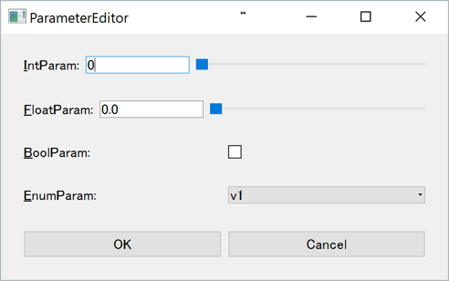
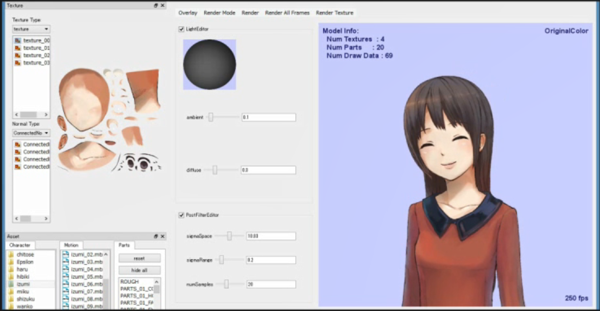

入出力とGUI: 画像処理用のGUIモジュール
====

ここでは，OpenCVで画像処理を行うことを前提に，
Pythonから利用可能なGUIモジュールとそれぞれの性質についてまとめたいと思います．

私自身のこれまでの開発経験を振り返りますと，
Python + OpenCVで比較的使えるGUIモジュールは以下の3つです．

* OpenCVのGUIモジュール: トラックバー，ペイント等の基本機能を備える．
* [matplotlib](http://matplotlib.org/): PythonでMATLABライクなプロットを実現．
* [PyQt](https://riverbankcomputing.com/software/pyqt/intro): Qtの高品質なGUIをPythonから利用．

以下では，少しそれぞれの特徴について見ていきます．

## OpenCVのGUIモジュール

OpenCVのGUIモジュールは，
シンプルですがプロトタイプを実験するのに適しています．

画像の表示が```cv2.imshow```関数で簡単に書けたり，

``` Python
cv2.namedWindow('image', cv2.WINDOW_NORMAL)
cv2.imshow('image', image_bgr)
```

トラックバーの作成も比較的簡単に書けます．

``` Python
trackbar = cv2.createTrackbar(param_name, win_name, param_min, param_max, callback)
```

また，マウスイベントやキーイベントも簡単に取得できます．

``` Python
def mouseCallback(event, x, y, flags, param):
    if event == cv2.EVENT_LBUTTONDOWN:
        print('Left-button is pressed.')

cv2.setMouseCallback(win_name, mouseCallback)
```

``` Python
key = cv2.waitKey(0) & 0xFF
if key == ord('q'):
    print('Q-key is pressed.')
```

一通りの機能は揃っているので，
プロトタイプ作成には便利です．

ただ少し難点があるとすれば，
テキストの描画機能が弱いことと，
複数枚の画像を並べるといった処理がやりにくいです．
(Windowを複数表示する形になります．)
また，画像の信号のデータをグラフとしてプロットするような用途にはあまり適していません．

## matplotlib

matplotlibは，MATLABみたいなグラフプロット機能を持つPythonの標準ライブラリです．
まずは，[ギャラリー](http://matplotlib.org/gallery.html)からできることを確認してみましょう．

Matplotの強みは，凡例・ラベル付きのグラフプロットを簡単なコードで書けることと，
複数枚の画像を並べる処理がやりやすいことです．

以下は，自分がこれまでに開発した物の中からMatplotを使った物を少し紹介します．

#### [画像のヒストグラム表示](https://github.com/tody411/ColorHistogram)

画像の色ヒストグラムを1次元プロット，2次元プロット，3次元プロットで表示します．
下の例は，L, h, Vに関する色ヒストグラムの1次元プロットです．


#### [画像の代表色抽出](https://github.com/tody411/PaletteSelection)

画像から指定した色数の代表色を抽出します．
色ヒストグラムを考慮した代表色抽出を行うことにより，
単純にK-Meansを行うよりも良好な代表色が得られます．


#### [自己組織化マップによる色分布の可視化](https://github.com/tody411/SOM-ColorManifolds)

Self-Organizing Map (SOM)による色分布の可視化です．
SOMは日本語訳だと，自己組織化マップや自己組織化写像と呼ばれています．


#### なぜMatplotを使うのか？

私がこれらのプロジェクトでMatplotを使った理由は，
1枚の図に実験結果を提示し易かったからです．

上のプロジェクトに見られるように，
各グリッドに対してラベル付きで画像を表示することができ，
さらにヒストグラムのようなグラフプロットや簡易的な3次元表示機能まで備わっています．

プログラムで配置した図を一枚の画像として出力できるので，
元画像と比較したり，様々な可視化が必要となる
画像処理では非常に便利なツールと言えます．

ただし，Matplotにも欠点はあり，
マウスペイント等のインタラクティブな処理は少し苦手です．
スライダーバー等のGUIもMatplotで作成することもできますが，
自分でレイアウト位置を調整したりする必要があり，
少し扱いづらい印象があります．
また，動画等を扱う場合にもインタラクティブな表示が行えるほど
処理速度は速くありません．

用途に合わせてOpenCVのGUIモジュールやPyQtを使い分ける必要があります．


## PyQt

PyQtを使えば，OpenCVのGUIモジュールやMatplotでは作成しづらかった
UIを格好良くデザインすることができます．

以下，C++版のプロジェクトのスナップショットも混じっていますが，
過去にQtを使って開発したGUIを紹介します．

#### シンプルなパラメータエディタ

まずは，単純なパラメータエディタです．
皆さんが一般的にアプリケーションで目にするGUIの見た目と
ほとんど同じだと思います．
PyQtを使えば，これらを簡単にデザインすることができ，
インタラクティブな画像処理につなげることができます．



#### Live2D Model Viewer

[Live2D](Live2D)のモデルに独自データを組み込んで表示するため，
QtとC++でViewerを自作しました．

スナップショットを見ていただくと，
パラメータエディタのGUIや各キャラクターのアセットを切り替えるための
データ選択GUIが含まれています．

Qtを使えば，こういったGUIを含む一つのパッケージソフトウェアを開発することができるので，
人に使ってもらうシステムを作成する場合は非常に便利です．



#### PyQtを使うケースは？

PyQtはPythonでGUIを作成するには非常に便利なライブラリですが，
それなりに学習コストがかかるのも事実です．

小規模な画像処理のプロトタイプであればOpenCVのGUIモジュール，
実験結果の画像生成が目的であればMatplotから始めてみるのをおススメします．

PyQtを使うケースとしては，
GUIがメインとなるシステムや人に使ってもらうアプリケーションを開発する時が
主になると思います．

###### PyQtのGUI開発の入り口

特に，Qtの機構として使われているシグナルとスロットは事前に学習しておく必要があります．
とはいっても，C++ではなくPyQtの場合は非常に簡単に書けるようになっているので，
概念さえ理解すれば使うこと自体は簡単です．

Parameterクラスを例にとってみましょう．

``` Python
class Parameter(QObject):
    valueChanged = pyqtSignal(object)

    def __init__(self):
        super(Parameter, self).__init__()

    def setValue(self, val):
        self._val = val
        self.valueChanged.emit(val)

def printParameter(val):
    print("Value Changed: %d" % val)

parameter = Parameter()
parameter.valueChanged.connect(printParameter)

parameter.setValue(10)
parameter.setValue(20)
```

まず，```valueChanged = pyqtSignal(object)```で定義されているのが
PyQtのシグナルです．```setValue```関数内で```self.valueChanged.emit(val)```を呼ぶことにより，
パラメータの値が```val```に変更されたということをクラス外部に通知しています．

実際にシグナルを利用する時は，```def printParameter(val):```のように，通知された値を受け取る関数を定義します．
この関数をスロットと呼び，シグナルの```connect```関数を使ってシグナルとスロットを結びつけることができます．

上の例では，まず，Parameterクラスのインスタンスを作り，```parameter.valueChanged.connect(printParameter)```を呼び出すことにより，
パラメータが変更された時に行う処理を```printParameter```として割り当てています．

このプログラムの出力結果は以下のようになります．

``` Python
Value Changed: 10
Value Changed: 20
```

もし，```parameter.valueChanged.connect(printParameter)```をコメントアウトすると，
出力はしなくなりますし，もっと他の関数を定義して例えばパラメータが変わった時に画像処理を行うといったことも可能です．

この機構さえ覚えてしまえば，PyQtのGUI開発はそんなに怖くありません．
色々と自分でGUIを開発してPyQtライフを楽しみましょう．
本サイトでも少しずつ実例を載せていきたいと思います．