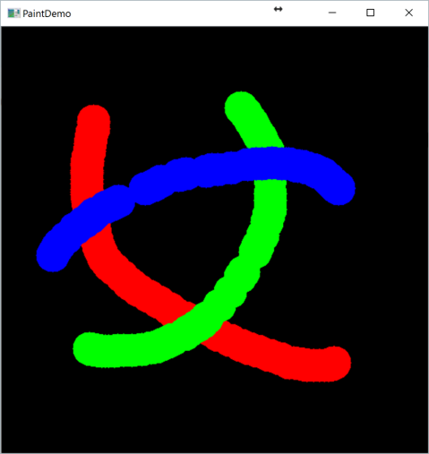

入出力とGUI: マウスペイント
====

ここでは，OpenCVによるマウスイベントの取り扱いについて学びます．

OpenCVで取得できるイベントは，以下のプログラムで列挙することができます．

``` Python
# OpenCVのイベントリストの出力
def printEvents():
    events = [i for i in dir(cv2) if 'EVENT' in i]
    print (events)
```

| 定数名  | 説明    |
|:-----------|:----------------------|
| EVENT_MOUSEMOVE | マウス移動時の処理 |
| EVENT_LBUTTONDOWN | マウス左ボタンが押された時の処理 |
| EVENT_LBUTTONUP | マウス左ボタンを離した時の処理 |
| EVENT_RBUTTONDOWN | マウス右ボタンが押された時の処理 |
| EVENT_RBUTTONUP | マウス右ボタンを離した時の処理 |
| EVENT_MOUSEWHEEL | マウスホイールを動かした時の処理 (**Pythonではサポート対象外**) |

残念ながら，マウスホイールに関してはC++版のみサポートしている模様です．

通常ペイント処理を行うときは，

* マウスドラッグ: ペイントの描画
* マウスリリース: ペイントに基づく画像処理

のように設計することが多いと思います．

そこで，以下のようなクラスを自作しておくと便利です．

``` Python
# OpenCVのマウスイベントを扱うためのクラス
class CVMouseEvent:
    def __init__(self, press_func=None, drag_func=None, release_func=None):
        self._press_func = press_func
        self._drag_func = drag_func
        self._release_func = release_func

        self._is_drag = False

    # Callback登録関数
    def setCallBack(self, win_name):
        cv2.setMouseCallback(win_name, self._callBack)

    def _doEvent(self, event_func, x, y):
        if event_func is not None:
            event_func(x, y)

    def _callBack(self, event, x, y, flags, param):
        # マウス左ボタンが押された時の処理
        if event == cv2.EVENT_LBUTTONDOWN:
            self._doEvent(self._press_func, x, y)
            self._is_drag = True

        # マウス左ドラッグ時の処理
        elif event == cv2.EVENT_MOUSEMOVE:
            if self._is_drag:
                self._doEvent(self._drag_func, x, y)

        # マウス左ボタンが離された時の処理
        elif event == cv2.EVENT_LBUTTONUP:
            self._doEvent(self._release_func, x, y)
            self._is_drag = False

```

CVMouseEventクラスでは，コンストラクタで以下の関数を入力として受け取っています．

* ```press_func```: マウス左ボタンが押された時の処理
* ```drag_func```: マウス左ドラッグ時の処理
* ```release_func```: マウス左ボタンが離された時の処理

それぞれの関数は，

``` Python
# マウスのxy座標に関する処理
def eventFunc(x, y):
    ...
```

の形で定義されている物を想定しています．

例えば，描画関数として，

``` Python
    # ドラッグ時に描画する関数の定義
    def brushPaint(x, y):
        cv2.circle(img, (x, y), 20, color, -1)
```

を定義し，

``` Python
    win_name = 'PaintDemo'
    cv2.namedWindow(win_name)

    # CVMouseEventクラスによるドラッグ描画関数の登録
    mouse_event = CVMouseEvent(drag_func=brushPaint)
    mouse_event.setCallBack(win_name)
```

のようにすると，簡単にマウスイベント用のCallBack関数を登録できます．

上記の実装を含む，
マウスペイントのサンプルコード全体は，
以下のようになります．

``` Python
import cv2
import numpy as np


# OpenCVのイベントリストの出力
def printEvents():
    events = [i for i in dir(cv2) if 'EVENT' in i]
    print (events)

# OpenCVのマウスイベントを扱うためのクラス
class CVMouseEvent:
    def __init__(self, press_func=None, drag_func=None, release_func=None):
        self._press_func = press_func
        self._drag_func = drag_func
        self._release_func = release_func

        self._is_drag = False

    # Callback登録関数
    def setCallBack(self, win_name):
        cv2.setMouseCallback(win_name, self._callBack)

    def _doEvent(self, event_func, x, y):
        if event_func is not None:
            event_func(x, y)

    def _callBack(self, event, x, y, flags, param):
        # マウス左ボタンが押された時の処理
        if event == cv2.EVENT_LBUTTONDOWN:
            self._doEvent(self._press_func, x, y)
            self._is_drag = True

        # マウス左ドラッグ時の処理
        elif event == cv2.EVENT_MOUSEMOVE:
            if self._is_drag:
                self._doEvent(self._drag_func, x, y)

        # マウス左ボタンが離された時の処理
        elif event == cv2.EVENT_LBUTTONUP:
            self._doEvent(self._release_func, x, y)
            self._is_drag = False


# 描画用の空画像作成
def emptyImage():
    return np.zeros((512, 512, 3), np.uint8)


# シンプルなマウス描画のデモ
def simplePaint():
    img = emptyImage()

    colors = [(0, 0, 255), (0, 255, 0), (255, 0, 0)]
    color = colors[0]

    # ドラッグ時に描画する関数の定義
    def brushPaint(x, y):
        cv2.circle(img, (x, y), 20, color, -1)

    win_name = 'PaintDemo'
    cv2.namedWindow(win_name)

    # CVMouseEventクラスによるドラッグ描画関数の登録
    mouse_event = CVMouseEvent(drag_func=brushPaint)
    mouse_event.setCallBack(win_name)

    while(1):
        cv2.imshow(win_name, img)

        key = cv2.waitKey(30) & 0xFF

        # 色切り替えの実装
        if key == ord('1'):
            color = colors[0]
        elif key == ord('2'):
            color = colors[1]
        elif key == ord('3'):
            color = colors[2]

        # 画像のリセット
        elif key == ord('r'):
            img = emptyImage()

        elif key == ord('q'):
            break

    cv2.destroyAllWindows()

if __name__ == '__main__':
    printEvents()
    simplePaint()
```

編集操作は以下のようになっていて，
数字キーで選択した描画色を左ドラッグでペイントできます．

| 編集操作  | 説明    |
|:-----------|:----------------------|
| 左ドラッグ | ペイント |
| 数字1キー | 描画色を赤にする |
| 数字2キー | 描画色を緑にする |
| 数字3キー  | 描画色を青にする |
| rキー | リセット |
| qキー | リセット |

