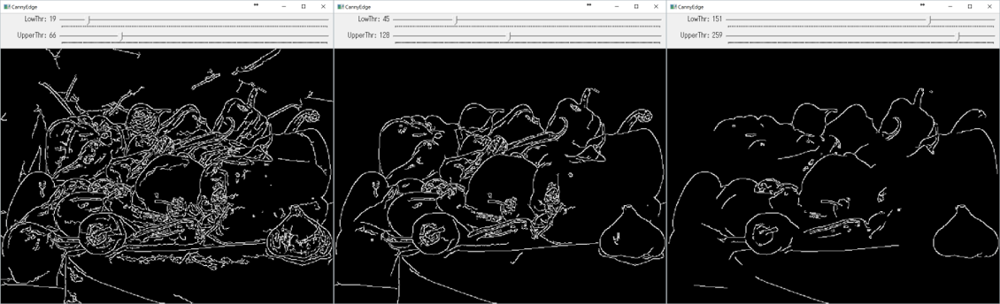

入出力とGUI: トラックバー
====

OpenCVでは，トラックバーというスライダー型のUIを提供しています
Pythonの場合，trackbarを利用する構文は，以下のようになっています．

``` Python
trackbar = cv2.createTrackbar(param_name, win_name, param_min, param_max, callback)
cv2.getTrackbarPos(param_name, win_name)
cv2.setTrackbarPos(param_name, win_name, value)
```

割と分かりやすい構文になっていると思いますが，
さらにこれをクラス化しておくとより簡単にスライダー処理を追加できます．

``` Python
# OpenCVのTrackbar便利クラス
class CVTrackbar:
    def __init__(self, param_name, win_name, param_min, param_max, update_func=doNothing):
        self._update_func = update_func
        self._trackbar = cv2.createTrackbar(param_name, win_name, param_min, param_max, self._callback)
        self._param_name = param_name
        self._win_name = win_name

    # Trackbarの値を参照
    def value(self):
        return cv2.getTrackbarPos(self._param_name, self._win_name)

    # Trackbarの値を設定
    def setValue(self, value):
        cv2.setTrackbarPos(self._param_name, self._win_name, value)

    def _callback(self, x):
        self._update_func(x)

    # TrackbarのCallbackを設定
    def setCallBack(self, update_func):
        self._update_func = update_func
```

使い方は，例えば，以下のようになります．

``` Python
    # LowThrという名前のトラックバーの作成
    low_threshold_trackbar = CVTrackbar("LowThr", win_name, 0, 200)
    low_threshold_trackbar.setValue(20)
    ...

    # Trackbarの値参照
    edge = cv2.Canny(L, low_threshold_trackbar.value(), upper_threshold_trackbar.value())
```

今回のデモでは，
CannyEdge抽出にトラックバーを利用してみます．
cv2.Cannyでは，以下のような構文でエッジを抽出します．

``` Python
    edge = cv2.Canny(image_gray, low_threshold, upper_threshold)
```

ここで，```low_threshold, upper_threshold```がそれぞれパラメータになっているので，
これをトラックバーでインタラクティブに動かしてみます．

すべてOpenCVで描画を行う場合，

``` Python
    low_threshold_trackbar = CVTrackbar("LowThr", win_name, 0, 200)
    low_threshold_trackbar.setValue(20)

    upper_threshold_trackbar = CVTrackbar("UpperThr", win_name, 0, 300)
    upper_threshold_trackbar.setValue(40)
    ...

    while True:
        ...

        # Canny Edgeのインタラクティブな描画更新
        if display_mode == display_modes[2]:
            edge = cv2.Canny(L, low_threshold_trackbar.value(), upper_threshold_trackbar.value())
            cv2.imshow(win_name, edge)
```

上記のような処理で，描画ループの中でトラックバーの値を参照しながら
CannyEdge抽出を行い，表示を更新することでインタラクティブに結果を確認できます．

| 編集操作  | 説明    |
|:-----------|:----------------------|
| トラックバー操作 | CannyEdgeパラメータの更新 |
| 数字1キー | RGB画像の表示 |
| 数字2キー | グレースケール画像の表示 |
| 数字3キー  | CannyEdge抽出結果の表示 |
| qキー | 終了 |



GUIと結果表示が別ウィンドウになってしまいますが，
matplotlibとOpenCVのトラックバーを組み合わせることもできます．

``` Python
    # Canny Edgeのインタラクティブな描画更新
    def updateValue(x):
        edge = cv2.Canny(L, low_threshold_trackbar.value(), upper_threshold_trackbar.value())
        edge_plt.set_array(edge)
        fig.canvas.draw_idle()

    low_threshold_trackbar.setCallBack(updateValue)
    upper_threshold_trackbar.setCallBack(updateValue)
```

この場合は，matplotlibのfigureの描画更新処理をスライダーのCallbackとして設定します．
少々無理やり感があるので，matplotlibの場合は，自前のSliderを使うか，
PyQtを使って自作した方が良いかもしれません．