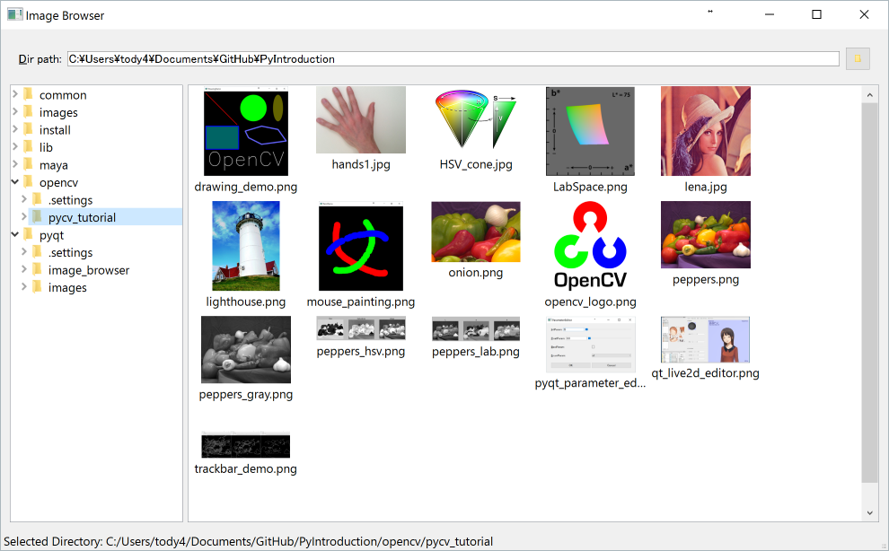
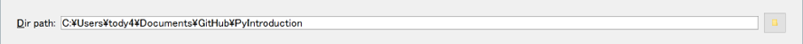
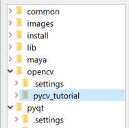
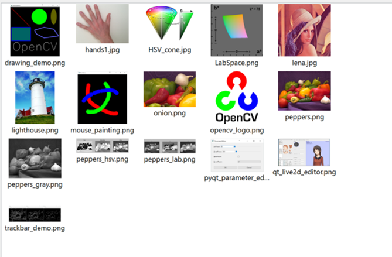

イメージブラウザの作成
====

まず，以下に示されるようなイメージブラウザを作成してみましょう．



プログラムのコードは[image_browser](image_browser)にあります．

### ディレクトリパスを指定するUI

まずは，ディレクトリパスを指定するUIから作成していきます．



コードは，[image_browser/dir_path_editor.py](image_browser/dir_path_editor.py)
にあります．

中で行っていることは，

* QLineEditをDrag&Drop対応にして，エクスプローラーからのDrag&Dropでフォルダを指定できるようにする
* QFileDialog.getExistingDirectory関数を利用してファイル選択ダイアログを開く

の主に2つです．

### ディレクトリ選択GUI

次に，ディレクトリ選択GUIを作成します．



コードは，[image_browser/directory_selector.py](image_browser/directory_selector.py)
にあります．

中で行っていることは，

* QFileSystemModelを利用してディレクトリ構造にアクセスする．
* QTreeViewを利用してディレクトリ構造の表示・選択を行う

の主に2つです．

### 画像リストビュー

最後の画像のリストを表示する部分です．



コードは，[image_browser/image_list_view.py](image_browser/image_list_view.py)
にあります．

中で行っていることは，

* QListWidgetItemを拡張して，画像ファイルパスとサムネイルを表示するImageIconクラスを作る．
* 指定されたディレクトリ内(サブディレクトリも含む)の画像を検索する．
* 検索された画像からImageIconオブジェクトを作り，QListWidgetに表示する．

の主に3つです．

選択機能の追加に関しては，ディレクトリ選択GUIとほぼ同様の手順で行っています．

### メインウィンドウの構成

プログラムのコードは[image_browser/main_window.py](image_browser/main_window.py)にあります．

GUIの配置には，QSplitterを使って，
ディレクトリ選択GUIと画像リストビューの区切りを分けています．

この時に便利なのが，QSizePolicyによるWidgetの割合の指定です．

``` Python
    splitter = QSplitter()

    directory_selector = DirectorySelector()
    ds_size_policy = directory_selector.sizePolicy()
    ds_size_policy.setHorizontalStretch(1)

    image_list_view = ImageListView()
    ilv_size_policy = image_list_view.sizePolicy()
    ilv_size_policy.setHorizontalStretch(4)
    image_list_view.setSizePolicy(ilv_size_policy)

    splitter.addWidget(directory_selector)
    splitter.addWidget(image_list_view)
```

上記のように指定すると，ディレクトリ選択GUIと画像リストビューの幅の割合を1:4に保ってくれます．

ステータスバーの出力も実装しています．
QStatusBarでは，```showMessage(message, timeout=0)```の形で出力メッセージを設定します．
ここでは，出力を簡単にするために，```message```の部分だけ取り出して実装します．

各，DirPathEditor, DirectorySelector, ImageListViewクラスでは，
message_loggingというシグナルをステータスバーの出力用に導入しています．

ステータスバーにメッセージを表示したいタイミングで

``` Python
    self.message_logging.emit("Selected Images: %d images." % len(files))
```

のようにすると，デバッグメッセージが```message_logging```シグナルに通知されます．

``` Python
    dir_path_selector.message_logging.connect(status_bar.showMessage)
    directory_selector.message_logging.connect(status_bar.showMessage)
    image_list_view.message_logging.connect(status_bar.showMessage)
```

メインウィンドウ側でこのようにつなげば，
各GUIから通知されたデバッグメッセージがステータスバーに出力されるようになります．